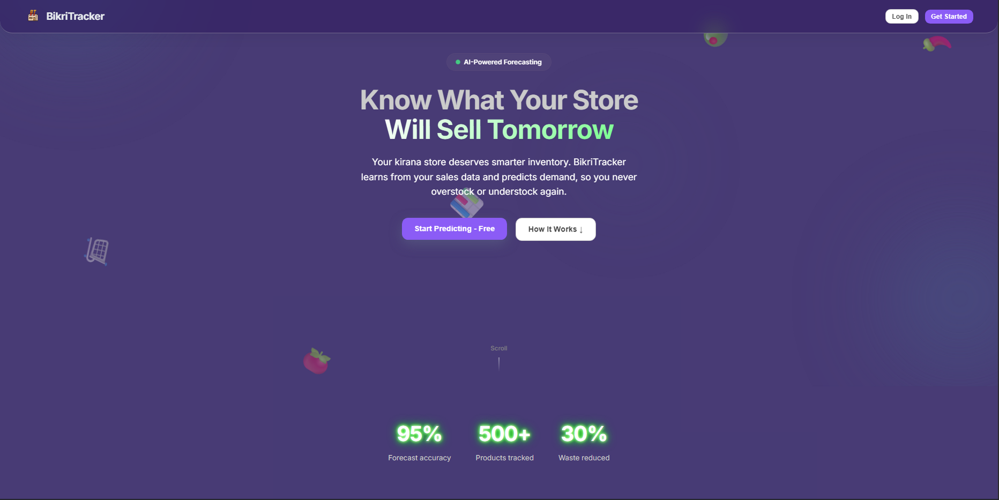
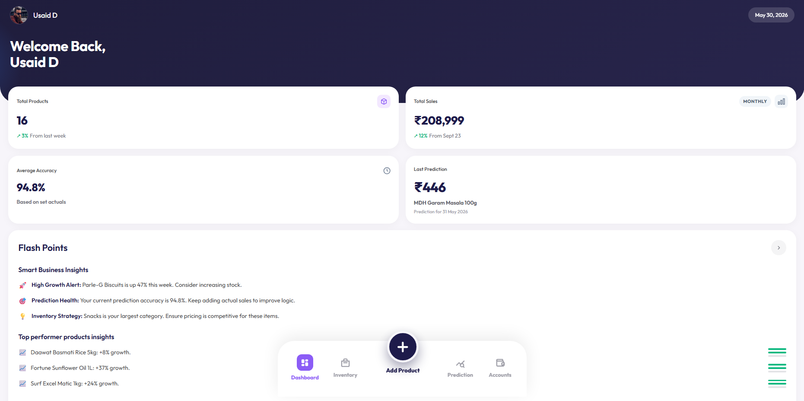

# BikriTracker — AI Sales Forecasting for Kirana Stores

> Predict demand, reduce waste, and never overstock again — built for Indian grocery store owners.

---






BikriTracker is a full-stack web application that helps kirana (Indian grocery) store owners forecast product sales using machine learning. Store owners log their daily/weekly sales history, and the app trains a per-product Random Forest model to predict future demand with confidence intervals.

Built as a Progressive Web App (PWA), it works on both desktop and mobile with a clean, modern UI.

---

## Features

- **AI Demand Forecasting** — Per-product Random Forest models trained on your own sales history. Models auto-retrain when enough new data is added.
- **Confidence Intervals** — Every prediction comes with a lower/upper bound and an uncertainty percentage derived from individual decision tree spread.
- **Sales History Management** — Inline editable history table with CSV paste support. Add, remove, and edit entries directly in the product modal.
- **QR & Barcode Scanning** — Scan any packaged product's EAN/UPC barcode to auto-fill product name and category via the Open Food Facts API. Also supports custom JSON QR codes.
- **Voice Input** — Use the Web Speech API to dictate product details hands-free. Parses spoken phrases like *"Name is Parle G, price is 10 rupees, city is Mumbai"* into structured form fields.
- **Real-Time Sync** — Firestore listeners keep all data live across devices simultaneously.
- **Dashboard Analytics** — Area charts for sales trends, donut chart for top products by revenue, flash-point business insights, and daily entry shortcuts.
- **Prediction Validation** — After a prediction date passes, enter actual sales to calculate accuracy. Track accuracy over time per product.
- **Dark Mode** — Full dark theme toggle persisted in localStorage.
- **PWA Support** — Installable on Android and iOS home screens via Web App Manifest.

---

## Tech Stack

### Frontend
| Technology | Purpose |
|---|---|
| Next.js 16 (Pages Router) | React framework, routing, SSR |
| React 18 | UI component library |
| Firebase SDK v12 | Auth (email/password) + Firestore real-time DB |
| Recharts | Area charts, pie/donut charts |
| html5-qrcode | Camera-based barcode & QR code scanning |
| Web Speech API | Browser-native voice recognition |
| styled-jsx | Scoped CSS-in-JS |
| Outfit (Google Font) | Typography |

### Backend
| Technology | Purpose |
|---|---|
| FastAPI | REST API, async endpoints |
| scikit-learn | Random Forest Regressor, cross-validation |
| pandas + numpy | Feature engineering, time-series processing |
| joblib | Model serialization and disk caching |
| Firebase Admin SDK | Server-side Firestore access |
| uvicorn | ASGI server |
| python-dotenv | Environment config |

### Infrastructure
| Technology | Purpose |
|---|---|
| Firebase Firestore | NoSQL real-time database |
| Firebase Authentication | User account management |
| Docker + docker-compose | Containerized local development |

---

## ML Architecture

Each product gets its own dedicated model. The training pipeline:

1. **Feature Engineering** (`feature_builder.py`)
   - Time features: year, month, day, weekday, is_weekend
   - Lag features: sales 1, 7, 14, 30 days ago
   - Rolling means: 7, 14, 30 day windows
   - Difference features: 1-day diff, 7-day % change
   - Target: `log1p(sales)` for variance stabilization

2. **Training** (`trainer.py`)
   - Random Forest with `n_estimators = min(200, max(50, rows × 2))`
   - Auto-retrain triggered when history grows by 10+ new rows
   - Cross-validation RMSE stored in model metadata
   - Models cached to disk via joblib with SHA-256 keyed filenames

3. **Prediction** (`predictor.py`)
   - Builds feature row for the target date appended to history
   - Confidence interval from individual tree predictions: `median ± 1.96 × std`
   - Accuracy proxy (SMAPE) estimated via walk-forward validation on last 7 actuals

---

## Firestore Data Model

```
users/{userId}
  ├── profile: { storeName, email, city, createdAt }
  │
  ├── products/{productId}
  │     name, category, subcategory, price, city, region
  │     history: [ { id, orderDate, sales } ]   ← array inside product doc
  │     historyCount, createdAt, updatedAt
  │
  └── predictions/{predictionId}
        productId, productName, predictionDate
        predicted, lowerBound, upperBound
        actual (nullable), accuracy (nullable)
        price, createdAt
```

---

## Project Structure

```
bikritracker-v2/
├── frontend/                   # Next.js app
│   ├── components/
│   │   ├── inventory/          # ProductModal, QRScannerModal, VoiceProductModal,
│   │   │                       # SalesHistoryTable, VoiceInputButton, ProductTable
│   │   ├── layout/             # Layout, Sidebar, TopBar, BottomNav
│   │   └── ui/                 # ModalPortal
│   ├── contexts/               # AuthContext, ThemeContext
│   ├── lib/
│   │   ├── hooks/              # useProducts, usePredictions, useDashboardStats
│   │   ├── api.js              # FastAPI client
│   │   ├── firebase.js         # Firebase init
│   │   ├── firestore.js        # All Firestore CRUD helpers
│   │   └── qrParser.js         # QR/barcode result parser
│   ├── pages/                  # index, dashboard, inventory, predict, login, signup, account
│   └── styles/                 # globals.css, landing.css
│
├── backend/                    # FastAPI app
│   ├── ml/
│   │   ├── feature_builder.py  # Feature engineering
│   │   ├── trainer.py          # Model training + caching
│   │   └── predictor.py        # Prediction + confidence intervals
│   ├── routes/
│   │   ├── predict.py          # POST /predict
│   │   ├── train.py            # POST /train, GET /train/status/{id}
│   │   └── health.py           # GET /health
│   ├── firebase_client.py      # Admin SDK + Firestore helpers
│   └── main.py                 # App entry, CORS
│
└── docker-compose.yml
```

---

## Getting Started

### Prerequisites
- Node.js ≥ 20
- Python ≥ 3.11
- A Firebase project (Firestore + Authentication enabled)

### 1. Firebase Setup

1. Create a Firebase project at [console.firebase.google.com](https://console.firebase.google.com)
2. Enable **Email/Password** authentication
3. Create a **Firestore** database
4. Download your **service account JSON** (Project Settings → Service Accounts)
5. Copy your **web config** (Project Settings → General → Your apps)

### 2. Frontend

```bash
cd bikritracker-v2/frontend
cp .env.local.example .env.local   # create this file manually if not present
```

Add to `.env.local`:
```env
NEXT_PUBLIC_FIREBASE_API_KEY=
NEXT_PUBLIC_FIREBASE_AUTH_DOMAIN=
NEXT_PUBLIC_FIREBASE_PROJECT_ID=
NEXT_PUBLIC_FIREBASE_STORAGE_BUCKET=
NEXT_PUBLIC_FIREBASE_MESSAGING_SENDER_ID=
NEXT_PUBLIC_FIREBASE_APP_ID=
NEXT_PUBLIC_BACKEND_URL=http://127.0.0.1:8000
```

```bash
npm install
npm run dev
# → http://localhost:3000
```

### 3. Backend

```bash
cd bikritracker-v2/backend

# Create and activate virtual environment
python -m venv venv
source venv/bin/activate          # Mac/Linux
# venv\Scripts\Activate.ps1       # Windows PowerShell

pip install -r requirements.txt
```

Create `.env`:
```env
FIREBASE_SERVICE_ACCOUNT_PATH=./firebase-service-account.json
CORS_ORIGINS=http://localhost:3000
MODEL_CACHE_DIR=./model_cache
MIN_HISTORY_ROWS=5
```

Place your `firebase-service-account.json` in the `backend/` folder, then:

```bash
python -m uvicorn main:app --reload --port 8000
# → http://127.0.0.1:8000/docs  (Swagger UI)
```

### 4. Docker (optional, runs both together)

```bash
cd bikritracker-v2
# Create .env.docker with your env vars
docker-compose up --build
```

---

## API Endpoints

| Method | Endpoint | Description |
|---|---|---|
| `GET` | `/health` | Health check |
| `POST` | `/predict` | Run prediction for a product |
| `POST` | `/train` | Trigger (re)training for a product |
| `GET` | `/train/status/{productId}` | Check model cache status |
| `DELETE` | `/train/cache/{productId}` | Invalidate cached model |

All endpoints require the `x-user-id` header (Firebase UID).

**Predict request body:**
```json
{
  "product_id": "abc123",
  "predict_date": "2025-06-01",
  "force_retrain": false
}
```

**Predict response:**
```json
{
  "prediction": 1450.00,
  "central": 1450.00,
  "lower_bound": 980.50,
  "upper_bound": 1919.50,
  "prediction_date": "2025-06-01",
  "uncertainty_pct": 22.1,
  "estimated_accuracy": 88.4,
  "cv_rmse": 0.1832,
  "rows_used": 45,
  "model_status": "trained"
}
```

---

## Environment Variables Reference

### Frontend (`.env.local`)
| Variable | Description |
|---|---|
| `NEXT_PUBLIC_FIREBASE_*` | Firebase web SDK config (6 values) |
| `NEXT_PUBLIC_BACKEND_URL` | FastAPI base URL |

### Backend (`.env`)
| Variable | Default | Description |
|---|---|---|
| `FIREBASE_SERVICE_ACCOUNT_PATH` | — | Path to service account JSON |
| `FIREBASE_SERVICE_ACCOUNT_JSON` | — | Raw JSON string (for cloud deployments) |
| `CORS_ORIGINS` | `http://localhost:3000` | Comma-separated allowed origins |
| `MODEL_CACHE_DIR` | `./model_cache` | Where models are cached |
| `MIN_HISTORY_ROWS` | `5` | Minimum history entries needed to train |

---

## License

MIT — see [LICENSE](LICENSE)